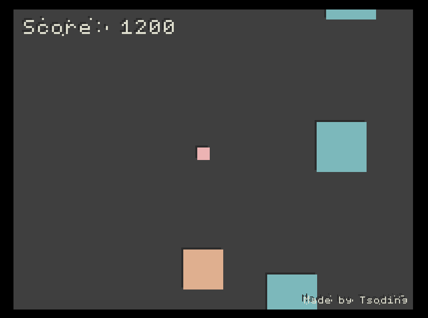

# [rust-browser-game](https://github.com/tsoding/rust-browser-game) but in UEFI instead of browser



# quick start

## deps
+ [rust](https://rust-lang.org/)
+ [gnu-efi](https://github.com/vathpela/gnu-efi)
+ [gcc](https://gcc.gnu.org/)
+ [make](https://www.gnu.org/software/make/make.html)

## build process
```shell
$ make
```

## running

after building everything you will see `game.efi` file and to run the game you will need to somehow run this file inside UEFI environment

you can use [qemu](http://www.qemu.org) with [edk2 UEFI firmware](https://github.com/tianocore/edk2) or any computer with UEFI support on it's motherboard (tho it wasn't tested on real hardware, so feel free to create an issue)

if you decided to use qemu with edk2 i can suggest using [uefi-run](https://github.com/Richard-W/uefi-run) for running everything.

# controls

| key                              | action                  |
|----------------------------------|-------------------------|
| <kbd>a</kbd>                     | move left by 20 pixels  |
| <kbd>d</kbd>                     | move right by 20 pixels |
| <kbd>space</kbd> or <kbd>w</kbd> | fire                    |
| <kbd>p</kbd>                     | pause                   |
